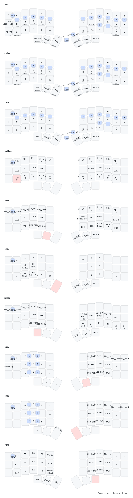

# ZMK Config

This repo contains the [ZMK firmware](https://zmk.dev) configuration files for my [Corne keyboard](https://github.com/foostan/crkbd/), which I purchased from the amazing people at [Typeractive](https://typeractive.xyz/). The keyboard layout is heavily inspired by [Miryoku](https://github.com/manna-harbour/miryoku) with very minor modifications. I recreated most of miryoku's features from scratch with the help of the [ZMK Discord community](https://zmk.dev/community/discord/invite) and Nick Coutsos' awesome [keymap editor](https://nickcoutsos.github.io/keymap-editor/) in order to gain a better understanding of ZMK's features. I highly recommend checking out the keymap editor if you're just getting started with ZMK.

## Keymap Features

- Colemak-DH keyboard layout

	I switched from QWERTY to [Colemak-DH](https://colemakmods.github.io/mod-dh/) in October 2023 for better typing ergonomics. So far, the change has been worth the effort, and it's what I have as the default keyboard layout.

- Numbers & symbols on base layer

	Since the Corne does not have a dedicated number row, unlike other popular boards with more keys ([Lily58](https://github.com/kata0510/Lily58)), I've implemented [combo keys](https://zmk.dev/docs/features/combos) on the base [layer](https://zmk.dev/docs/features/keymaps#layers) which gives me quick access to numbers and symbols. The same numbers & symbols are also available on separate layers.

- Caps word & caps lock
 
 	The [Caps word](https://zmk.dev/docs/behaviors/caps-word) key, available on the left middle edge, activates caps lock for a single word. This is comes in handy when typing environment variables (`STRIPE_SECRET_KEY=123`), short acronyms (`SQL`, `HTML`, `API`, `NASA`, etc.), and editing constant variables at work like `WARNING_CHANGING_THIS_VARIABLE_MAY_CAUSE_CATASTROPHIC_FAILURE_IN_PRODUCTION = 1` :^)

 	There's also an option to toggle the traditional caps lock behavior by pressing `shift` + `caps word`.

 - Sticky shift & sticky hyper

	The [Sticky shift](https://zmk.dev/docs/behaviors/sticky-key) key, available on the bottom left corner, keeps the shift key pressed until another key is pressed or when the 2 second timer is up (configurable), whichever comes first. It can also be toggled off by pressing the key again.

	Pressing `shift` + `sticky shift` will activate the hyper key (`ctrl`, `alt`, `win`, `shift`), which is useful for creating custom keyboard shortcuts that open or switch between commonly used apps. For example `hyper` + `b` can be used to open your browser and `hyper` + `e` to switch to your editor of choice. Very powerful.

- Homerow mods

	[Homerow mods](https://precondition.github.io/home-row-mods) are powerful and convenient, but can be tricky to set up. I've settled on a comfortable configuration that avoids accidental modifier key activations 99% of the time.

	```c++
	hrm_l: homerow_mods_left {
				compatible = "zmk,behavior-hold-tap";
				label = "HOMEROW_MODS_LEFT_HAND";
				bindings = <&kp>, <&kp>;

				#binding-cells = <2>;
				tapping-term-ms = <200>;
				hold-trigger-key-positions = <6 7 8 9 10 11 18 19 20 21 22 23 30 31 32 33 34 35 39 40 41>;
				flavor = "balanced";
				hold-trigger-on-release;
				quick-tap-ms = <200>;
				require-prior-idle-ms = <125>;
			};

	hrm_r: homerow_mods_right {
				compatible = "zmk,behavior-hold-tap";
				label = "HOMEROW_MODS_RIGHT_HAND";
				bindings = <&kp>, <&kp>;

				#binding-cells = <2>;
				tapping-term-ms = <200>;
				hold-trigger-key-positions = <0 1 2 3 4 5 12 13 14 15 16 17 24 25 26 27 28 29 36 37 38>;
				hold-trigger-on-release;
				flavor = "balanced";
				quick-tap-ms = <200>;
				require-prior-idle-ms = <125>;
			};
	```
	The [hold-tap](https://zmk.dev/docs/behaviors/hold-tap) doc page covers each of these options in greater detail.

	In short, if you find yourself accidentally triggering a modifier, it might help to slowly increase the tapping term to something in the 200-250ms range like so:
	`tapping-term-ms = <225>;`.

	A different option to try is changing the hold-tap flavor to tap-preferred: 
	`flavor = "tap-preferred";`.
	This way, modifiers are only triggered when holding a key down longer than the configured `tapping-term-ms`, which in this case is 200 milliseconds.

	If key misfires are still a problem, try the following:

	> The most important tip I can give is to get into the habit of typing with quick, swift taps. The goal is to reduce the time between press and release to the minimum. Don’t focus on pressing keys, but on tapping keys. -- [precondition](https://precondition.github.io/home-row-mods#quick-swift-taps)

- Extra symbols layer (sym2)

	In addition to the stock symbol layer provided by the Miryoku layout, I also have an extra symbols layer labeled `sym2`, inspired by Pascal Getreuer's [Designing a Symbol Layer](https://getreuer.info/posts/keyboards/symbol-layer/index.html) post. The problem I have is, placing the same symbols across multiple layers adds a lot of mental overhead, which is why this extra layer has largely gone unused. I'm still making changes and looking for ways to merge parts of this layer into the main `sym` layer through the use of combo keys. In the future, I plan on replacing this layer with a [mouse emulation](https://github.com/manna-harbour/miryoku/tree/master/docs/reference#mouse) layer as soon as mouse support is implemented in ZMK.

- Miryoku reference

	The rest of my layout is identical to Miryoku's. Check out the [reference manual](https://github.com/manna-harbour/miryoku/tree/master/docs/reference) for further details.

